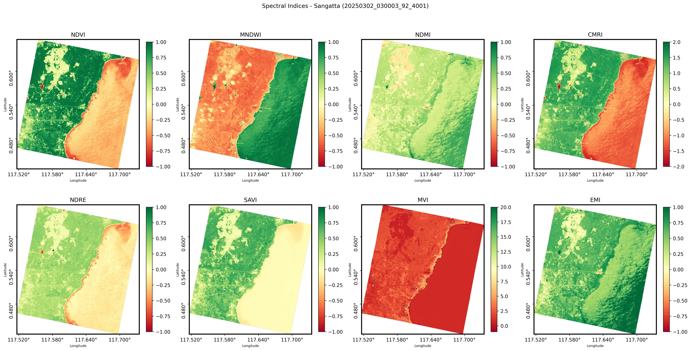
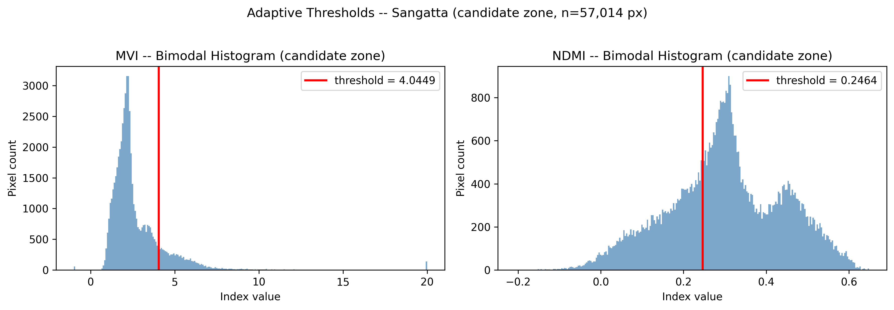
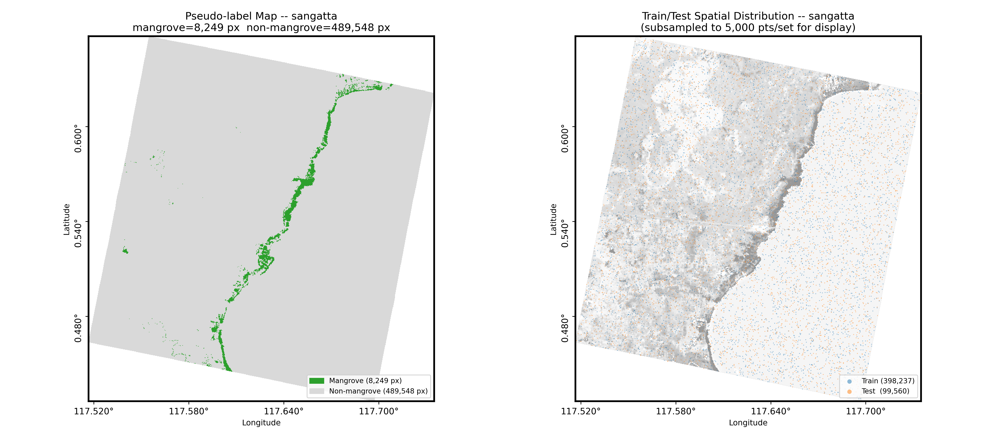
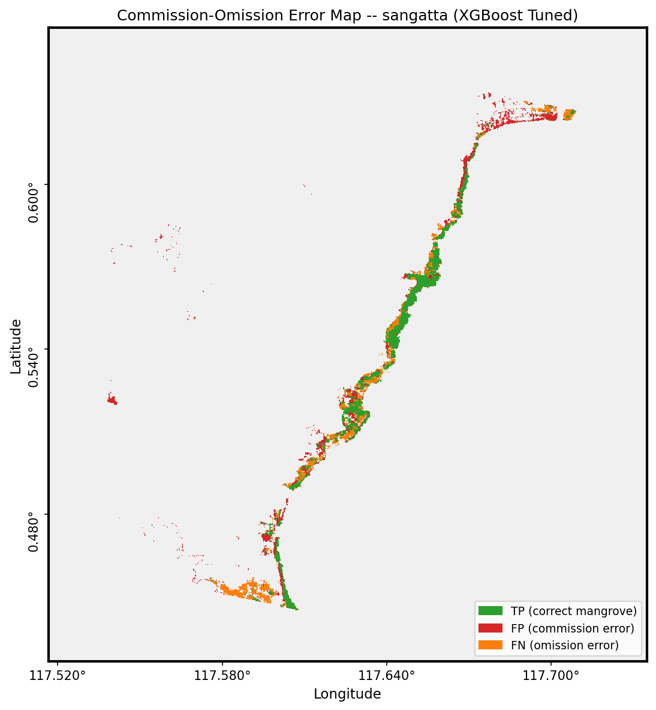
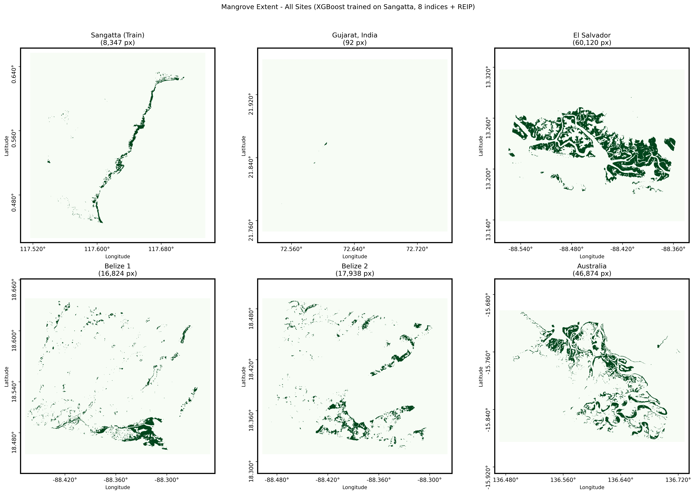
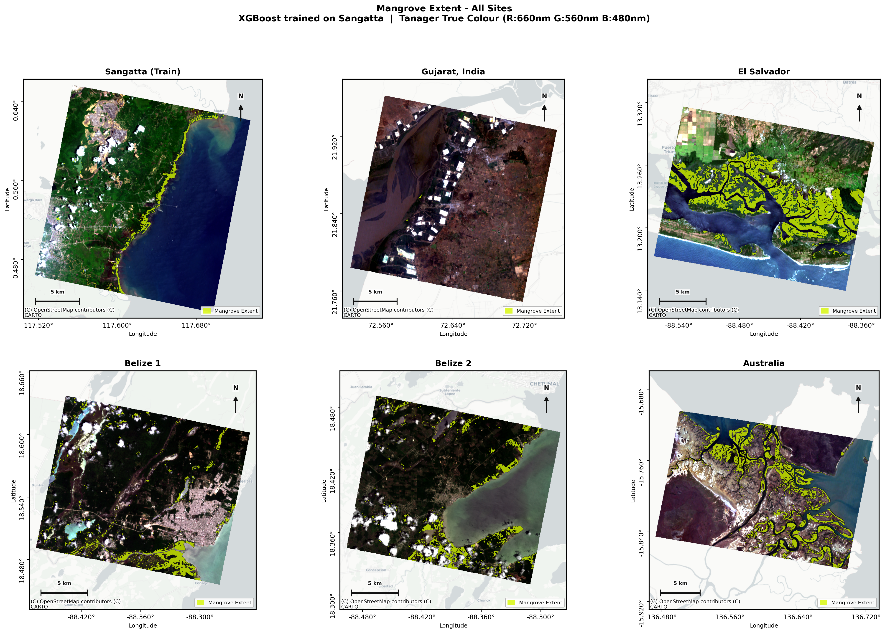

# tanager-mangrove-mapping

**Transferable Mangrove Extent Mapping from Tanager-1 Hyperspectral Imagery Using Adaptive Spectral Thresholds**

Submitted to the [Planet Tanager Open Data Competition](https://www.planet.com/) (August 2026).

---

## Overview

This repository implements a transferable framework for mangrove extent mapping using Tanager-1 hyperspectral imagery (426 bands, 380–2500 nm, 30 m resolution).

**Core innovation:** per-scene adaptive spectral threshold calibration via histogram bimodal detection (with Otsu fallback), eliminating the need for fixed thresholds from external studies and enabling transferability across geographic regions without retraining. Open water is masked via MNDWI before thresholding to keep bimodal peaks clean.

**Hyperspectral feature:** the Red-edge Inflection Point (REIP) is derived from the full 426-band spectrum and added to the classifier feature stack. REIP requires many narrow contiguous red-edge bands and cannot be reproduced from broadband multispectral sensors (Sentinel-2, Landsat), so it acts as the hyperspectral hook that distinguishes this framework from a purely multispectral approach.

**Pipeline:**

```
Tanager-1 HDF5 (data/raw/)
    └── Step 1: Band extraction → GeoTIFF (6 bands) → data/processed/
    └── Step 2: Spectral indices (NDVI, MNDWI, NDMI, CMRI, NDRE, SAVI, MVI, EMI)
    └── Step 3: REIP from full 426-band spectrum (hyperspectral-only feature)
    └── Step 4: Coastal candidate mask (MNDWI + SAVI Otsu, 500 m distance cap)
    └── Step 5: Per-scene adaptive threshold  ← core innovation
                bimodal valley detection; Otsu fallback if unimodal (MVI forced Otsu)
    └── Step 6: Pseudo-labels (MVI ∧ NDMI) → XGBoost (9 features: 8 indices + REIP)
    └── Step 7: Zero-shot transfer to 5 scenes - no retraining
```

## Study Sites

| Site | Scene ID | Role |
|---|---|---|
| Sangatta, Kutai Timur (Indonesia) | `20250302_030003_92_4001` | Training anchor |
| Gujarat, India | `20250311_061550_53_4001` | Transfer site 1 |
| El Salvador | `20250223_165546_32_4001` | Transfer site 2 |
| Belize (strip 1) | `20250824_171853_67_4001` | Transfer site 3a |
| Belize (strip 2) | `20250824_171857_84_4001` | Transfer site 3b |
| Australia | `20250608_014315_58_4001` | Transfer site 4 |

## Figures

### NB01 - Spectral indices (Sangatta)

Eight spectral indices computed from the 6-band GeoTIFF. MVI and NDMI provide the
bimodal signal used by the adaptive threshold stage.



### NB01 - Adaptive threshold calibration (Sangatta)

Per-scene histogram analysis within the coastal candidate zone. MVI uses forced Otsu;
NDMI uses bimodal valley detection. Thresholds are saved to JSON and replayed at transfer
time - no retraining required.



### NB02 - Pseudo-label map and train/test split (Sangatta)

Left: pseudo-labels generated from MVI > 4.04 AND NDMI > 0.25, constrained to the
candidate zone. Right: spatial distribution of the 80/20 train-test split (398 k / 99 k samples).



### NB02 - Commission-omission error map (Sangatta, XGBoost Tuned)

Green = true positive (correct mangrove), red = commission error (false positive),
orange = omission error (false negative). Evaluated within the candidate zone only (57,014 pixels).



### NB03 - Predicted mangrove extent - all sites

XGBoost trained on Sangatta applied zero-shot to all six scenes (8 indices + REIP, no retraining).
Gujarat near-blank panel reflects negligible mangrove cover at that scene.



### NB03 - Extent maps overlaid on Tanager true-colour imagery

Predicted mangrove (green overlay) on Tanager true-colour composite
(R:660 nm, G:560 nm, B:480 nm) for all six scenes.



---

## Results

### Training site - Sangatta (vs. GMW v3)

| Model | OA | Kappa | Precision | Recall | F1 | IoU |
|---|---|---|---|---|---|---|
| XGBoost Tuned | 0.887 | 0.548 | 0.625 | 0.605 | 0.615 | 0.444 |

### Zero-shot transferability (XGBoost Tuned, vs. GMW v3)

| Site | Area (ha) | Kappa | Precision | Recall | F1 | IoU |
|---|---|---|---|---|---|---|
| Australia | 4,258.7 | 0.627 | 0.855 | 0.722 | 0.783 | 0.643 |
| El Salvador | 5,411.2 | 0.579 | 0.943 | 0.734 | 0.826 | 0.703 |
| Belize 1 | 1,512.9 | 0.505 | 0.421 | 0.807 | 0.553 | 0.382 |
| Belize 2 | 1,617.8 | 0.236 | 0.178 | 0.732 | 0.287 | 0.167 |
| Gujarat | 8.1 | −0.001 | - | - | - | - |

**Notes:**
- Australia and El Salvador transfer well (F1 > 0.78 and 0.83 respectively).
- Belize 2 has low precision, likely due to adjacent scene overlap and cloud/shadow edge effects.
- Gujarat fails completely: the scene contains negligible mangrove cover (8.1 ha) relative to scene extent, causing the adaptive threshold to produce near-zero detections. This is a known limitation of pseudo-label-based transfer to very sparse sites.

## Repository Structure

```
tanager-mangrove-mapping/
├── notebooks/
│   ├── 01_preprocessing.ipynb        # HDF5 inspection, band extraction, indices, adaptive threshold, REIP
│   ├── 02_classification.ipynb       # Pseudo-labels, XGBoost training + tuning, GMW v3 evaluation
│   ├── 03_transferability.ipynb      # Zero-shot transfer to 5 scenes, accuracy summary table
│   └── journal/                      # Scenario B ablation (journal publication only, not competition)
│       ├── 01b_multispectral_equivalent.ipynb
│       ├── 02b_classification.ipynb
│       └── 03b_transferability.ipynb
├── src/
│   ├── preprocessing.py             # HDF5 I/O, GeoTIFF conversion, indices, adaptive threshold, REIP
│   ├── classification.py            # Pseudo-labels, RF + XGBoost, evaluation
│   ├── evaluation.py                # GMW v3 accuracy assessment (confusion, kappa, agreement maps)
│   ├── transferability.py           # run_transfer_scene(), run_all_transfer_sites(), TRANSFER_SITES registry
│   ├── spatial_viz.py               # Shared map visualization helpers (used by all notebooks)
│   ├── spectral_resampling.py       # S2A SRF convolution (journal/Scenario B only)
│   └── gedi_utils.py                # GEDI helpers (unused - biomass out of scope)
├── references/                      # Planet's reference implementation (not part of this submission)
│   ├── 00_download_data.py
│   ├── 01_feature_extraction.py
│   ├── 02a_model_training.py
│   ├── 02b_model_analysis.py
│   ├── 02c_best_model_chart.py
│   ├── 03_model_inference.py
│   ├── 04a_visualizations_inference.py
│   ├── 04b_visualizations_aoi.py
│   └── src/                         # Reference helper modules (config, gee_utils, raster, etc.)
├── run_03.py                        # Standalone local script equivalent of NB03
├── data/
│   ├── raw/                         # HDF5 originals from Planet STAC (gitignored)
│   ├── processed/                   # GeoTIFF band files + output rasters (gitignored)
│   ├── aoi/                         # AOI polygons per site (.geojson + shp/)
│   ├── gmw_v3/                      # GMW v3 validation subsets (.geojson + shp/)
│   └── sentinel2_srf/               # ESA S2A SRF files (journal/Scenario B only)
└── outputs/
    ├── figures/                     # Maps and plots (150 dpi PNG)
    ├── models/                      # Trained RF + XGBoost (.joblib, gitignored)
    ├── vector/                      # Mangrove extent GeoPackages per site (.gpkg)
    └── results/                     # Accuracy tables (.csv), thresholds per scene (.json)
```

## Setup

```bash
conda env create -f environment.yml
conda activate tanager-mangrove
```

A `requirements.txt` is provided for pip-only environments (e.g. Google Colab):

```bash
pip install -r requirements.txt
```

Primary execution environment is **Google Colab**. For local runs, uncomment the local `ROOT` path in each notebook's setup cell and comment out the Colab path.

## Running the Pipeline

Run notebooks in order. Each notebook saves outputs consumed by the next.

| Notebook | Key input | Key output |
|---|---|---|
| `01_preprocessing` | `data/raw/{site}_{scene_id}_ortho_sr_hdf5.h5` | `data/processed/*_bands.tif`, `reip_*.tif`, `outputs/results/thresholds_*.json` |
| `02_classification` | processed GeoTIFFs + REIP + thresholds JSON | `outputs/models/xgb_tuned_*.joblib`, `outputs/results/gmw_eval_*.csv` |
| `03_transferability` | XGBoost model + processed GeoTIFFs (transfer sites) | `outputs/results/thresholds_*.json` per site, `transferability_summary_xgboost.csv`, `outputs/vector/*.gpkg` |

Alternatively, run the transferability stage locally without Colab:

```bash
python run_03.py
```

**HDF5 internal path note:** the reflectance dataset is at `HDFEOS/GRIDS/HYP/Data Fields/surface_reflectance` - note the literal space in "Data Fields". QGIS displays this as `Data_Fields` (an underscore), which is a display artifact only. h5py requires the space.

## Known Limitations

- **Gujarat transfer failure:** negligible mangrove presence relative to scene extent causes near-zero pseudo-label generation. The adaptive threshold framework assumes at least a bimodal MVI/NDMI distribution, which breaks for very sparse sites.
- **Belize 2 low precision:** adjacent strip overlap and scene-edge artifacts inflate false positives.
- **Map visualization in NB03:** basemap tiles may fail to load depending on the rendering environment (Colab network restrictions). This is a known issue and does not affect accuracy results.

## License

MIT License. See `LICENSE`.

## References

- Baloloy, A. B., Blanco, A. C., Sta. Ana, R. R. C., & Nadaoka, K. (2020). Development and application of a new mangrove vegetation index (MVI) for rapid and accurate mangrove mapping. ISPRS Journal of Photogrammetry and Remote Sensing, 166, 95–117. https://doi.org/10.1016/j.isprsjprs.2020.06.001
- Belgiu, M., & Dragut, L. (2016). Random forest in remote sensing: A review of applications and future directions. ISPRS Journal of Photogrammetry and Remote Sensing, 114, 24–31. https://doi.org/10.1016/j.isprsjprs.2016.01.011
- Bunting, P., Rosenqvist, A., Lucas, R. M., Rebelo, L., Hilarides, L., Thomas, N., Hardy, A., Itoh, T., Shimada, M., & Finlayson, C. M. (2018). The Global Mangrove Watch - A new 2010 global baseline of mangrove extent. Remote Sensing, 10(10), 1669. https://doi.org/10.3390/rs10101669
- Gao, B.-C. (1996). NDWI - A normalized difference water index for remote sensing of vegetation liquid water from space. Remote Sensing of Environment, 58(3), 257–266. https://doi.org/10.1016/S0034-4257(96)00067-3
- Huete, A. R. (1988). A soil-adjusted vegetation index (SAVI). Remote Sensing of Environment, 25(3), 295–309. https://doi.org/10.1016/0034-4257(88)90106-X
- Lassalle, G., Ferreira, M. P., La Rosa, L. E. C., Scafutto, R. D. M., & De Souza Filho, C. R. (2022). Advances in multi- and hyperspectral remote sensing of mangrove species: A synthesis and study case on airborne and multisource spaceborne imagery. ISPRS Journal of Photogrammetry and Remote Sensing, 195, 298–312. https://doi.org/10.1016/j.isprsjprs.2022.12.003
- Nie, X., Xue, Z., & Li, X. (2026). Label-free mangrove mapping from temporally consistent PlanetScope imagery with interpretable deep unfolding network. ISPRS Journal of Photogrammetry and Remote Sensing, 235, 19–37. https://doi.org/10.1016/j.isprsjprs.2026.02.035
- Rahmila, Y. I., Prasetyo, L. B., Kusmana, C., Suyadi, Basyuni, M., Slamet, B., Pranoto, B., Yulianti, M., Yeny, I., Halwany, W., Rahmania, R., Januar, H. I., Adji, A. S., & Munawaroh. (2026). Mangrove Ecosystem Health Index (MEHI): a new method to evaluate mangrove ecosystem health at landscape scale using spatial metrics, canopy density, and potential disturbance based on hexagonal grid. Forest Science and Technology, 1–20. https://doi.org/10.1080/21580103.2026.2616443
- Xu, H. (2006). Modification of normalised difference water index (NDWI) to enhance open water features in remotely sensed imagery. International Journal of Remote Sensing, 27(14), 3025–3033. https://doi.org/10.1080/01431160600589179
